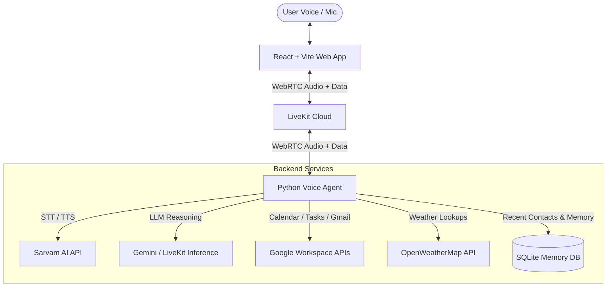

# Vaani (वाणी) — Intelligent AI Voice Assistant

<div align="center">

**A multilingual, tool-enabled AI voice assistant designed for natural Indian voice interactions.**  
Powered by **LiveKit**, **Sarvam AI**, **Google Workspace**, and **React**.

[](https://www.python.org/)
[](https://nodejs.org/)
[](https://livekit.io/)
[](https://sarvam.ai/)
[](https://vitejs.dev/)

</div>

---

## 🌟 Highlights & Features

- **Natural Indian Voice Interaction**:
  - **STT**: High-accuracy Indian English and Indic speech recognition powered by Sarvam AI (`sarvam.STT(language="en-IN")`).
  - **Configurable TTS**: Dual Sarvam voice options (**Male** and **Female** voices) selectable dynamically before conversation starts.
  - **Voice Pipeline**: Real-time turn detection and adaptive interruption handling via LiveKit Agents framework.

- **Google Workspace Integration**:
  - 📅 **Google Calendar**: Check daily agenda, list upcoming events, search meetings, and schedule new calendar events with conflict checking.
  - ✅ **Google Tasks**: Create tasks, view pending/completed tasks, and mark tasks as complete.
  - ✉️ **Gmail**: Create email drafts and send emails with voice commands.

- **Smart Email Recipient Memory**:
  - **Persistent SQLite Storage**: Remembers frequently used contact names and email addresses.
  - **Auto-Resolution**: Automatically matches spoken contact names to stored email addresses without repetitive prompting.
  - **Interactive Recipient Picker**: Proactively displays an on-screen recipient picker *only* when multiple matching contacts exist (e.g. "Rahul Verma" vs "Rahul Sharma"), letting the user pick with one click.
  - **Zero Guessing**: Never invents email addresses; saves new contacts automatically when provided.

- **Futuristic Ambient UI**:
  - Modern glassmorphism with 4-corner blue-purple ambient neon glow.
  - Real-time soundwave bar visualizer.
  - Live status indicators (`connecting`, `listening`, `thinking`, `speaking`, `muted`).
  - Microphone mute toggle and seamless call controls.
  - Fully responsive on mobile and desktop viewports.

- **Extensible Tool Ecosystem**:
  - Real-time weather lookups via OpenWeatherMap.
  - Persistent conversational memory across sessions.

---

## 🏗️ Architecture



---

## 📁 Repository Structure

```
Vaani/
├── .env.local.example            # Root environment variable template
├── .gitignore                    # Global gitignore protecting all secrets
├── README.md                     # Project documentation (this file)
│
├── frontend/                     # React + Vite Web Client
│   ├── .env.example              # Frontend environment template
│   ├── package.json              # Frontend scripts and dependencies
│   ├── vite.config.ts            # Vite dev server & LiveKit token server
│   ├── src/
│   │   ├── App.tsx               # Main Vaani UI & LiveKit integration
│   │   ├── App.css               # Futuristic glassmorphism & neon aura styles
│   │   ├── main.tsx              # React application entrypoint
│   │   └── assets/               # Female & male voice avatar graphics
│   └── public/                   # Static icons and assets
│
└── my-voice-agent/               # Python Voice Assistant Backend
    ├── .env.example              # Voice agent environment template
    ├── pyproject.toml            # Python dependencies (managed via uv)
    ├── setup_google_calendar.py  # Google OAuth 2.0 authorization CLI script
    ├── src/
    │   ├── agent.py              # Main voice agent worker & tool definitions
    │   ├── memory.py             # SQLite memory & recipient resolution engine
    │   ├── google_calendar_auth.py # Google Calendar tool integrations
    │   ├── google_gmail.py       # Gmail drafting & sending tools
    │   └── google_tasks.py       # Google Tasks management tools
    └── tests/                    # 110+ Automated unit tests
        ├── test_agent.py
        ├── test_calendar_auth.py
        ├── test_google_gmail.py
        └── test_google_tasks.py
```

---

## ⚙️ Prerequisites

Before getting started, make sure you have the following installed:

1. **Python**: Python `3.10` or higher.
2. **uv**: Modern, fast Python package manager ([installation instructions](https://github.com/astral-sh/uv)):
   ```bash
   # Windows (PowerShell)
   powershell -ExecutionPolicy ByPass -c "irm https://astral.sh/uv/install.ps1 | iex"

   # macOS / Linux
   curl -LsSf https://astral.sh/uv/install.sh | sh
   ```
3. **Node.js**: Node.js `18.0.0` or higher (`npm` included).
4. **LiveKit Cloud Account**: A free project on [LiveKit Cloud](https://cloud.livekit.io/).
5. **Sarvam AI Account**: An API key from [Sarvam AI](https://www.sarvam.ai/).
6. **Google Cloud Project**: (Optional, for Calendar, Tasks, and Gmail)
   - Enable **Google Calendar API**, **Google Tasks API**, and **Gmail API**.
   - Create OAuth 2.0 Client Credentials (Desktop/Web application) with redirect URI `http://localhost:8080/oauth/callback`.

---

## 🚀 Quickstart Guide

### 1. Clone the Repository

```bash
git clone https://github.com/your-username/Vaani.git
cd Vaani
```

### 2. Configure Environment Variables

Create `.env.local` files for the backend and frontend from their provided templates.

#### Backend Environment:
In `my-voice-agent/.env.local`:
```env
# LiveKit Cloud Credentials
LIVEKIT_URL=wss://your-project.livekit.cloud
LIVEKIT_API_KEY=your_livekit_api_key
LIVEKIT_API_SECRET=your_livekit_api_secret

# Sarvam AI
SARVAM_API_KEY=your_sarvam_api_key

# OpenWeatherMap (Optional)
WEATHER_API_KEY=your_weather_api_key

# Google OAuth 2.0 Credentials (Optional)
GOOGLE_CLIENT_ID=your_client_id.apps.googleusercontent.com
GOOGLE_CLIENT_SECRET=your_google_client_secret
GOOGLE_REDIRECT_URI=http://localhost:8080/oauth/callback
```

#### Frontend Environment:
In `frontend/.env.local`:
```env
VITE_LIVEKIT_URL="wss://your-project.livekit.cloud"
LIVEKIT_URL="wss://your-project.livekit.cloud"
LIVEKIT_API_KEY="your_livekit_api_key"
LIVEKIT_API_SECRET="your_livekit_api_secret"
```

*(You can also place `.env.local` at the root directory of the workspace for convenience).*

---

### 3. Setup Backend (Voice Agent)

```bash
cd my-voice-agent

# Install dependencies into virtual environment
uv sync

# (Optional) Authorize Google Workspace (Calendar, Tasks, Gmail)
uv run python setup_google_calendar.py
```

### 4. Setup Frontend

```bash
cd ../frontend

# Install dependencies
npm install
```

---

## 🏃 Running Vaani Locally

### Step 1: Start the Voice Agent Worker
In a terminal window:
```bash
cd my-voice-agent
uv run python src/agent.py dev
```
*(Alternatively, you can run `lk agent dev` if you have the LiveKit CLI installed).*

### Step 2: Start the Frontend Client
In a second terminal window:
```bash
cd frontend
npm run dev
```

### Step 3: Open the App
Visit **`http://localhost:5173`** in your browser.
1. Click **"Start Conversation"**.
2. Select your preferred voice: **Female Voice** or **Male Voice**.
3. Click **"Continue"** and grant microphone access when prompted.
4. Speak naturally to Vaani!

---

## 🧪 Running Tests

### Backend Unit Tests (110 Tests)
```bash
cd my-voice-agent
uv run pytest
```
Tests cover:
- Agent function tools registration and invocation.
- Recipient resolution: exact match, multiple matches, unknown recipients.
- SQLite recipient memory storage and retrieval.
- Google Calendar authentication, event listings, and conflict detection.
- Gmail message composition and drafting.
- Google Tasks creation, query, and completion.

### Frontend Production Build
```bash
cd frontend
npm run build
```
Validates TypeScript type safety and packages client assets.

---

## 🔑 Environment Variables Reference

| Variable | Required | Description |
| :--- | :---: | :--- |
| `LIVEKIT_URL` | **Yes** | WebSocket connection URL for your LiveKit Cloud project (`wss://...`). |
| `LIVEKIT_API_KEY` | **Yes** | LiveKit API Key for room tokens and agent dispatch. |
| `LIVEKIT_API_SECRET` | **Yes** | LiveKit API Secret. |
| `SARVAM_API_KEY` | **Yes** | Sarvam AI API Key for speech-to-text and text-to-speech. |
| `WEATHER_API_KEY` | No | OpenWeatherMap API Key for live weather queries. |
| `GOOGLE_CLIENT_ID` | No | Google OAuth 2.0 Client ID for Calendar, Tasks, and Gmail access. |
| `GOOGLE_CLIENT_SECRET` | No | Google OAuth 2.0 Client Secret. |
| `GOOGLE_REDIRECT_URI` | No | OAuth redirect callback URL (default: `http://localhost:8080/oauth/callback`). |
| `GOOGLE_TOKEN_PATH` | No | Custom path to store Google user credentials (default: `google_calendar_token.json`). |

---

## 🔒 Security & Pre-Push Checklist

Before pushing to GitHub or any public remote:

- [x] **No hardcoded secrets**: All API keys and secrets are loaded via environment variables.
- [x] **Gitignore active**: `.env`, `.env.local`, `*.db`, `*token*.json`, `node_modules/`, and `.venv/` are strictly ignored by `.gitignore`.
- [x] **Safe templates**: Only `.env.example` / `.env.local.example` with placeholder strings are tracked.
- [x] **Verified build**: `uv run pytest` and `npm run build` pass cleanly.

---

## 📄 License

This project is open source and available under the [MIT License](LICENSE).
